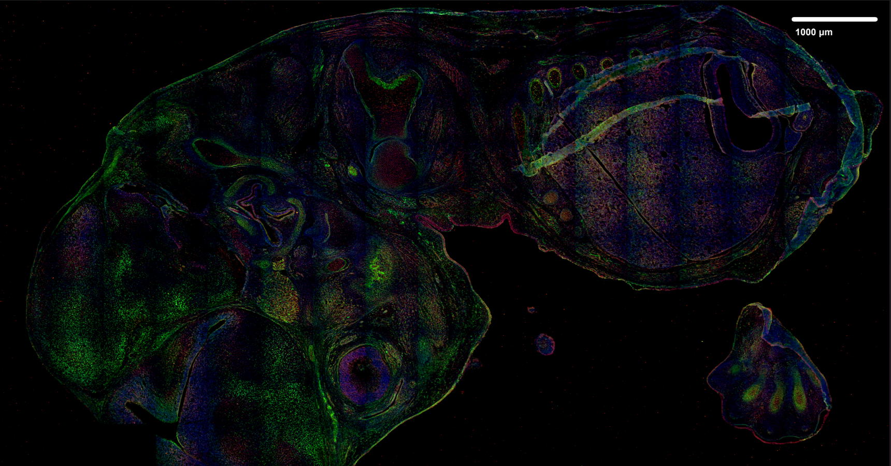
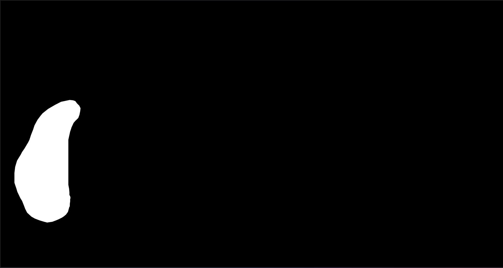
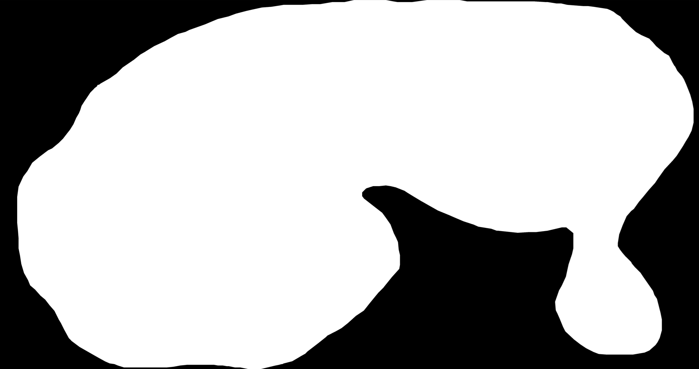
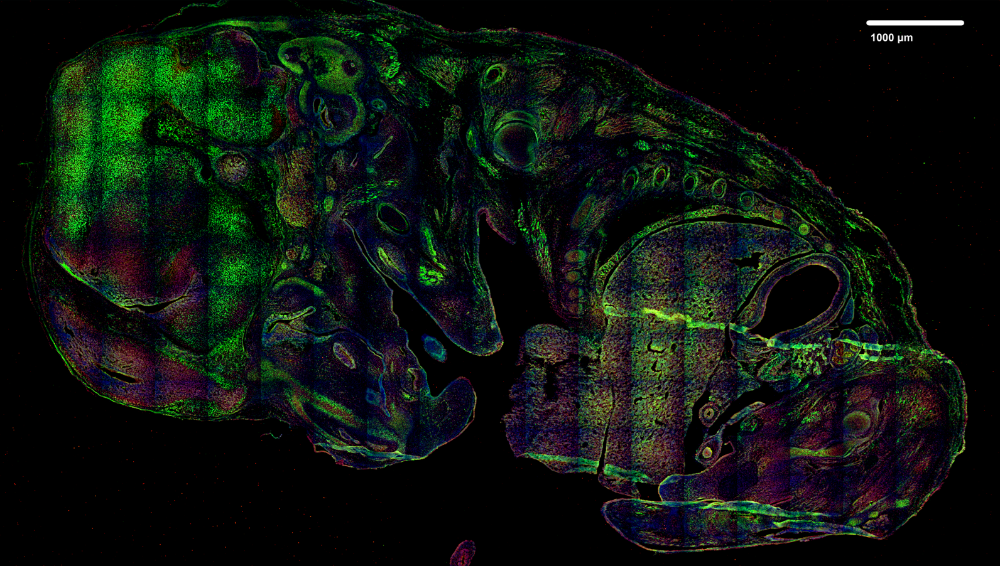
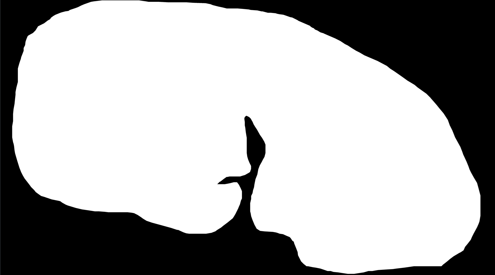
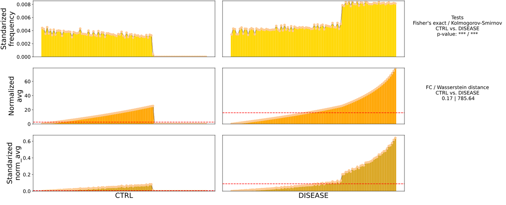

### JIMG_ncd – Python library for automated nucleus detection and analysis


</br>

<p align="right">
    
    
</p>

</br>

### Author: Jakub Kubiś 

<div align="left">
 Institute of Bioorganic Chemistry<br />
 Polish Academy of Sciences<br />
</div>


## Description


<div align="justify">


**JIMG_ncd** is a Python library designed for DL based automated nucleus detection and analysis in high-resolution images from confocal microscopy and flow cytometry, eg. [Amnis-ImageStream](https://cytekbio.com/pages/imagestream). It facilitates in-depth examination of nuclei and their chromatin organization, enabling precise analysis of nuclear morphology and chromatin structure.

Additionally, JIMG_ncd provides advanced tools for analyzing cell populations from cytometric data. Users can select distinctive cellular features, cluster cells based on these characteristics, and apply statistical analyses to uncover unique features within each cluster.
 
 

</div>

</br>


<br />

## 📚 Table of Contents
- 1.[Installation](#installation)
- 2.[Documentation](#doc)
- 3.[Example pipelines](#epip)
  - 3.1. [Nuclei analysis - confocal microscopy](#nacm)
    - 3.1.1 [Testing analysis parameters](#nacm1)
    - 3.1.2 [Performing nuclei analysis with adjusted parameters](#nacm2)
    - 3.1.3 [Selecting nuclei based on nucleus parameters](#nacm3)
    - 3.1.4 [Extracting nuclei chromanitization features](#nacm4)
    - 3.1.5 [Adjusting nuclei chromanitization parameters](#nacm5)
    - 3.1.6 [Analyzing nuclei series](#nacm6)
    - 3.1.7 [Obtaining nuclei series analysis results](#nacm7)
    - 3.1.8 [Analyzing nuclei chromatinization series](#nacm8)
    - 3.1.9 [Obtaining nuclei chromatinization series analysis results](#nacm9)
  - 3.2. [Nuclei analysis - flow cytometry](#nafc)
    - 3.2.1 [Testing analysis parameters](#nafc1)
    - 3.2.2 [Performing nuclei analysis with adjusted parameters](#nafc2)
    - 3.2.3 [Selecting nuclei based on nucleus parameters](#nafc3)
    - 3.2.4 [Extracting nuclei chromanitization features](#nafc4)
    - 3.2.5 [Adjusting nuclei chromanitization parameters](#nafc5)
    - 3.2.6 [Analyzing nuclei chromatinization series](#nafc6)
    - 3.2.7 [Obtaining nuclei chromatinization series analysis results](#nafc7)
    - 3.2.8 [Concatenating nuclei chromatinization analysis with ImageStream (IS) data](#nafc8)
    - 3.2.9 [Combining projects from nuclei chromatinization analysi](#nafc9)

  - 3.3. [Clustering and DFA (Differential Feature Analysis) – nuclei data](#cdnd)
    - 3.3.1 [Selecting feature analysis (DFA) for separate experiments data](#cdnd1)
    - 3.3.2 [Filtering project data to selected features](#cdnd2)
    - 3.3.3 [Performing data scaling and dimensionality reduction](#cdnd3)
    - 3.3.4 [Performing UMAP & clustering](#cdnd4)
    - 3.3.5 [Obtaining complete data and metadata (clusters)](#cdnd5)
    - 3.3.6 [Preforming DFA analysis on clusters](#cdnd6)
    - 3.3.7 [Preforming proportion analysis](#cdnd7)
<br />

<br />

# 1. Installation <a id="installation"></a>

#### In command line write:

```
pip install jimg_int
```

# 2. Documenation <a id="doc"></a>

Documentation for classes and functions is available here 👉 [Documentation 📄](https://jkubis96.github.io/JIMG_ncd/jimg_ncd.html)


# 3. Example pipelines <a id="epip"></a>

If you want to run the examples, you must download the test data. To do this, use:

```
from jimg_ncd.nuclei import test_data

test_data()
```


<br />

#### 3.1 Nuclei analysis - confocal microscopy <a id="nacm"></a>

##### 3.1.1 Testing analysis parameters <a id="nacm1"></a>


#### 7.4 Marker intensity analysis - confocal microscopy <a id="miacm"></a>

##### 7.4.1 Data collection <a id="miacmdc"></a>


```
from JIMG_analyst_tool.features_selection import FeatureIntensity

# Select intenity are data for 1st Image - healthy

# initiate class
fi = FeatureIntensity()

# check current metadata
fi.current_metadata

# if required, change parameters
fi.set_projection(projection = 'avg')

fi.set_correction_factorn(factor = 0.2)

# fi.set_scale(scale = 0.5)
# fi.set_selection_list(rm_list = [2,5,6,7])
# OR
# load JIMG project where scale and rm_lis is set in project metadata
# fi.load_JIMG_project_(path = '')
# for more information go to: https://github.com/jkubis96/JIMG
# rm_list and scale can be omitted

# load image
fi.load_image_3D(path = 'test_data/intensity/ctrl/image.tiff')

# or 1D image after projection, be sure that image was not adjusted, for analysis should be use !RAW! image
# fi.load_image_(path)
```
<br/>

##### Analysed image projection (after projection with JIMG)

* input image in this case is raw 3D-image in *.tiff format

<p align="center">

</p>

<br/>

```
fi.load_mask_(path = 'test_data/intensity/ctrl/mask_1.png')
```
<br/>

##### Analysed image region mask


<p align="center">

</p>

<br/>

```
fi.load_normalization_mask_(path = 'test_data/intensity/ctrl/background_1.png')
```
<br/>

##### Normalization region mask (reversed)


<p align="center">

</p>

<br/>

```
# strat calculations
fi.run_calculations()


# get results
results = fi.get_results()


# save results for further analysis, ensuring each feature 
# is stored in a separate directory (single directory 
# should contain data with the same 'feature_name'),
# this setup allows running fi.concatenate_intensity_data() 
# in the specific directory of each feature
# while preventing errors from incorrect feature concatenation

fi.save_results(path = os.getcwd(), 
             mask_region = 'brain', 
             feature_name = 'Feature1', 
             individual_number = 1, 
             individual_name = 'CTRL')


###############################################################################


# Select intenity are data for 2st Image - disease

# initiate class
fi = FeatureIntensity()

fi.set_projection(projection = 'avg')

fi.set_correction_factorn(factor = 0.2)

fi.load_image_3D(path = 'test_data/intensity/dise/image.tiff')
```
<br/>

##### Analysed image projection (after projection with JIMG)

* input image in this case is raw 3D-image in *.tiff format

<p align="center">

</p>

<br/>

```
fi.load_mask_(path = 'test_data/intensity/dise/mask_1.png')
```
<br/>

##### Analysed image region mask


<p align="center">

</p>

<br/>

```
fi.load_normalization_mask_(path = 'test_data/intensity/dise/background_1.png')
```
<br/>

##### Normalization region mask (reversed)


<p align="center">

</p>

<br/>

```
fi.run_calculations()

results = fi.get_results()

fi.save_results(path = os.getcwd(), 
             mask_region = 'brain', 
             feature_name = 'Feature1', 
             individual_number = 1, 
             individual_name = 'DISEASE')


# concatenate data of experiment 1 & 2
fi.concatenate_intensity_data(directory = os.getcwd(), name = 'example_data')
```

<br />

##### 7.4.2 Data analysis <a id="miacmda"></a>

```
from JIMG_analyst_tool.features_selection import IntensityAnalysis
import pandas as pd


# initiate class
ia = IntensityAnalysis()


input_data = pd.read_csv('example_data_Feature1_brain.csv')

# check columns
input_data.head()

data = ia.df_to_percentiles(data = input_data,
                                       group_col = 'individual_name',
                                       values_col = 'norm_intensity', sep_perc = 1)


results = ia.hist_compare_plot(data = data,
                               queue = ['CTRL', 'DISEASE'],
                               tested_value = 'avg', p_adj = True, txt_size = 20)


```
<br/>

##### Results of intensity comparison analysis (region under the mask)

<p align="center">

</p>

<br/>

```
results.savefig('example_results.svg', format = 'svg', dpi = 300, bbox_inches = 'tight')
```

<br />
<br />

### Have fun JBS


